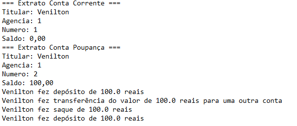

# Desafio Banco Digital

- Essa pasta do repositório conta com a abstração de um banco digital para o paradigma de programação orientada a objetos em Java, contendo as classes:
  - Banco
  - Cliente (Classe/Objeto utilizado no construtor da Conta)
  - Conta (Classe pai da Conta Corrente e Poupança)
  - ContaCorrente (Classe filha da Conta)
  - ContaPoupanca (Classe filha da Conta)
  - IConta (Interface da Conta)
  - Main (classe main do projeto)
- Para utilizá-la é necessário criar um Cliente pela instância de objeto do mesmo nome. Após isso, é possível criar uma Conta Corrente ou Poupança com o objeto cliente, que pode fazer ações como depositar, sacar, transferir o dinheiro para outra conta e também ver o histórico de ações da conta
- Exemplo de execução

